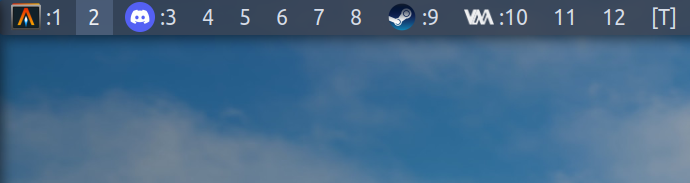
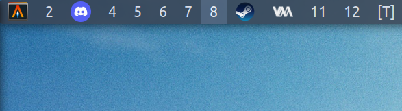

## dwm-tagicon

Application icons for tags in [dwm](https://dwm.suckless.org/).

Use [dwm-tagicon-6.5.diff](dwm-tagicon-6.5.diff) if your dwm is already patched with [winicon](https://dwm.suckless.org/patches/winicon/)\
otherwise use [dwm-winicon-tagicon-6.5.diff](dwm-winicon-tagicon-6.5.diff).

### Screenshots

with overwrite:\

### Requirements

- imlib2
